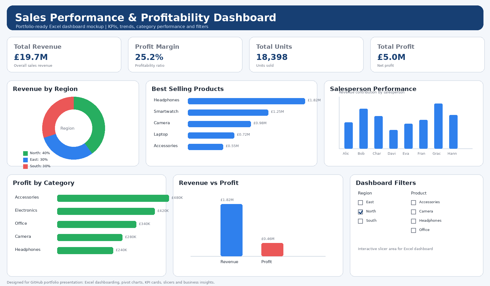

# Data Analytics Portfolio
SQL | Power BI | Excel | Data Visualisation | Business Intelligence

# Project 1
**Title:** [Sales Performance & Profitability Dashboard](https://github.com/Princetim101/Princetim101.github.io/blob/main/Sales_Dashbaord.png)

**Tools Used:** Microsoft Excel (Power Query editor, Slicers, Conditional Formatting, Excel, PivotTables, PivotCharts, Slicers, Data Visualization)

**Project Description:** Developed an interactive Excel Sales Performance & Profitability Dashboard to provide actionable insights into business performance across regions, products, and sales teams. The dashboard leverages PivotTables, Pivot Charts, KPI cards, and dynamic slicers to enable users to explore data interactively and monitor key metrics in real time.

Through detailed analysis, the project identified key revenue drivers, top-performing products, regional sales trends, and profitability patterns, helping uncover opportunities to improve sales performance and maximise profit. Users can quickly filter and analyse data by region, product category, and salesperson, allowing for more informed business decision-making.

The dashboard tracks critical business metrics including Total Revenue, Total Profit, Profit Margin, and Units Sold, presenting complex data in a clear and visually engaging format.

This project demonstrates expertise in data analysis, business intelligence, dashboard design, data visualisation, and Excel reporting, showcasing the ability to transform raw data into meaningful insights that support strategic decision-making.

**Key Insights:** • The East region is the primary driver of revenue, contributing the largest share of total sales, indicating strong regional demand.

• Headphones are the top-performing product, significantly outperforming other categories and representing a key revenue stream.

• The overall profit margin remains strong at approximately 25%, reflecting efficient cost management and healthy profitability.

• Sales performance varies across team members, with top performers generating substantially higher revenue, highlighting opportunities for performance optimization.

• Accessories contribute the highest profit among categories, suggesting higher margins compared to other product groups.

• A clear gap between revenue and profit across segments indicates potential areas to improve cost efficiency and maximize profitability.

**Dashboard Overview:**

# Project 2: Sales Database Management System Using SQL Server

## Title
Sales Database Management System Using SQL Server

## Technology Used
- SQL Server

## SQL Skills Used
- CREATE DATABASE
- CREATE TABLE
- INSERT INTO
- ALTER TABLE
- TRUNCATE TABLE
- DROP TABLE
- Data Definition Language (DDL)
- Data Manipulation Language (DML)
- Database Design
- Data Management

## Project Description
This project demonstrates the practical application of SQL Server for database creation, table design, data insertion, schema modification, and database management.

A sales database was designed and implemented to store information relating to salespersons, regions, cities, product categories, products, quantities sold, and unit prices. The project showcases fundamental SQL concepts used in real-world database environments.

--Create Database
--CREATE DATABASE STATEMENT

CREATE DATABASE Sales_Management_DB

--Create Table Statement

CREATE TABLE Table_SQL_01
(
    Salespersons_ID VARCHAR(100),
    Date_of_Birth DATE,
    Region VARCHAR(100),
    City VARCHAR(100),
    Category VARCHAR(100),
    Product VARCHAR(100),
    Qty VARCHAR(100),
    UnitPrice DECIMAL(10,2)
)

DROP TABLE [dbo].[Table_SQL_01]

CREATE TABLE Table_SQL_PRO
(
    Salespersons_ID VARCHAR(100),
    Date_of_Birth DATE,
    Region VARCHAR(100),
    City VARCHAR(100),
    Category VARCHAR(100),
    Product VARCHAR(100),
    Qty INT,
    UnitPrice DECIMAL(10,2)
)
--Insert Table Statement

INSERT INTO [dbo].[Table_SQL_PRO]
VALUES
('ID07351','1/1/2022','East','Boston','Bars','Carrot',33,1.77),
('ID07352','1/4/2022','East','Boston','Crackers','Whole Wheat',87,3.49),
('ID07353','1/7/2022','West','Los Angels','Cookies','Chocolate Chip',58,1.87),
('ID07354','1/10/2022','East','New York','Cookies','Chocolate Chip',82,1.97)

--TRUNCATE TABLE STATEMENT

TRUNCATE TABLE [dbo].[Table_SQL_PRO]

INSERT INTO [dbo].[Table_SQL_PRO]
VALUES
('ID07351','1/1/2022','East','Boston','Bars','Carrot',33,1.77),
('ID07352','1/4/2022','East','Boston','Crackers','Whole Wheat',87,3.49),
('ID07353','1/7/2022','West','Los Angels','Cookies','Chocolate Chip',58,1.87),
('ID07354','1/10/2022','East','New York','Cookies','Chocolate Chip',82,1.97)

--ALTER TABLE STATEMENT

ALTER TABLE [dbo].[Table_SQL_PRO]
ADD AGE INT

DROP TABLE [dbo].[Table_SQL_PRO]
